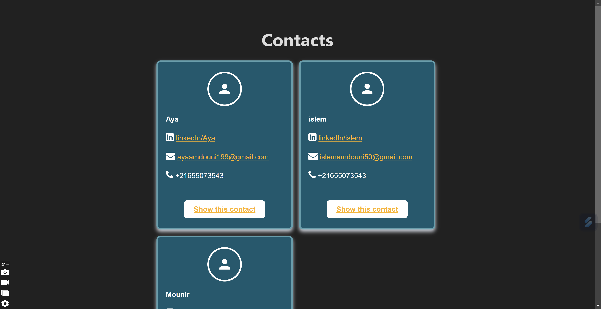

# README
This is a simple project using **Ruby on Rails** framework to develop a contacts application

## Versions:

* Ruby version : *3.3.5*

* Rails version: *7.2.1.2*

## To run the application: 
Run the following command

``
rails server
``
